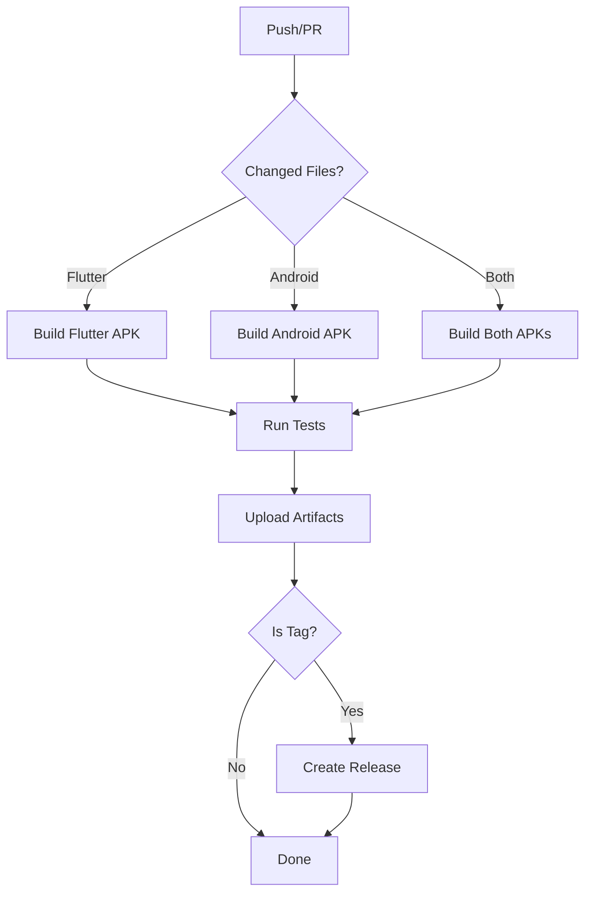

# 🤖 GitHub Actions Workflows

هذا المجلد يحتوي على جميع الـ workflows المطلوبة لبناء واختبار تطبيقات Marina Hotel تلقائياً.

## 📋 الـ Workflows المتاحة

### 1. 📱 Build APKs (`build-apks.yml`)
**الغرض**: بناء ملفات APK لكلا التطبيقين تلقائياً

**متى يعمل**:
- عند Push لـ branches: `main`, `develop`, `capy/**`
- عند فتح Pull Request
- يدوياً من GitHub Actions tab

**المخرجات**:
- `flutter-apks-{sha}` - ملفات Flutter APK
- `android-apks-{sha}` - ملفات Android APK  
- `marina-hotel-apks` - جميع الملفات مجمعة مع README

**الميزات**:
- ✅ بناء debug و release APKs
- ✅ Cache للتسريع
- ✅ تسمية تلقائية للملفات
- ✅ معلومات شاملة عن البناء
- ✅ رفع الملفات لمدة 30-90 يوم

### 2. 🚀 Release APKs (`release.yml`)
**الغرض**: إنشاء إصدارات رسمية مع ملفات APK

**متى يعمل**:
- عند إنشاء Git tag بصيغة `v*.*.*` (مثل v1.0.0)
- يدوياً مع تحديد رقم الإصدار

**المخرجات**:
- GitHub Release مع ملفات APK مرفقة
- Release notes تلقائية
- ملفات APK بأسماء تحتوي على رقم الإصدار

**الميزات**:
- ✅ إصدارات رسمية على GitHub
- ✅ Release notes تلقائية
- ✅ تحميل مباشر للـ APKs
- ✅ أرشفة طويلة المدى

### 3. 🧪 Tests & Code Quality (`tests.yml`)
**الغرض**: اختبار جودة الكود والتأكد من سلامة التطبيقات

**متى يعمل**:
- مع كل Push و Pull Request
- يدوياً للاختبارات الشاملة

**الاختبارات المتضمنة**:
- **Flutter Tests**: تحليل الكود، الفورمات، الاختبارات
- **Android Tests**: Lint، Unit tests، Compilation
- **Login Tests**: التحقق من تكوين admin/1234
- **Security Scan**: فحص أمني أساسي
- **Build Check**: التأكد من بناء التطبيقات

### 4. 🔄 PR Checks (`pr-checks.yml`)
**الغرض**: فحص Pull Requests تلقائياً

**الميزات**:
- ✅ تحليل تلقائي للـ PR
- ✅ بناء سريع للتحقق
- ✅ فحص جودة الكود
- ✅ تعليقات تلقائية
- ✅ إضافة Labels تلقائية
- ✅ التحقق من حفظ إعدادات admin/1234

## 🔐 إعدادات تسجيل الدخول

جميع الـ workflows تتحقق من أن التطبيقات مُكونة بشكل صحيح لاستخدام:
- **اسم المستخدم**: `admin`
- **كلمة المرور**: `1234`

## 📥 كيفية تحميل ملفات APK

### من Build العادي:
1. اذهب إلى **Actions** tab في GitHub
2. اختر أي workflow run ناجح  
3. scroll down إلى **Artifacts** section
4. حمّل `marina-hotel-apks`

### من Release:
1. اذهب إلى **Releases** في الـ repository
2. اختر أحدث release
3. حمّل الملفات من **Assets** section

## ⚙️ متطلبات البيئة

الـ workflows تستخدم:
- **Flutter**: v3.24.5
- **Java**: v17 (Temurin)
- **Android SDK**: API 34
- **Build Tools**: 34.0.0
- **Runner**: Ubuntu Latest

## 🚀 كيفية تشغيل الـ Workflows

### تلقائياً:
- **Push** لأي branch مدعوم → يشغل Build + Tests
- **PR** لـ main/develop → يشغل PR Checks
- **Git Tag** v*.*.* → يشغل Release

### يدوياً:
1. اذهب إلى **Actions** tab
2. اختر الـ workflow المطلوب
3. اضغط **Run workflow**
4. اختر الإعدادات المطلوبة

## 🔄 الـ Workflow Flow



## 📊 تقارير ونتائج

كل workflow ينتج:
- **Summary Report** في GitHub Actions
- **Artifacts** للتحميل  
- **Logs** مفصلة لكل خطوة
- **Notifications** في حالة الفشل

## 🛠 استكشاف الأخطاء

### إذا فشل البناء:
1. تحقق من الـ logs في GitHub Actions
2. تأكد من أن الكود يعمل محلياً
3. تحقق من إعدادات الـ environment variables

### إذا لم تظهر الـ Artifacts:
1. تأكد من أن البناء اكتمل بنجاح
2. تحقق من الـ retention period (30-90 يوم)
3. تأكد من الصلاحيات المطلوبة

### إذا فشل الـ Release:
1. تأكد من صيغة الـ tag صحيحة (v1.0.0)
2. تحقق من صلاحيات GITHUB_TOKEN
3. تأكد من أن البناء نجح أولاً

## 🔧 تخصيص الـ Workflows

لتعديل إعدادات الـ workflows:

1. **تغيير إصدار Flutter**:
   ```yaml
   env:
     FLUTTER_VERSION: '3.24.5'  # غيّر هنا
   ```

2. **إضافة branches جديدة**:
   ```yaml
   on:
     push:
       branches: [ main, develop, 'feature/**' ]  # أضف هنا
   ```

3. **تغيير retention period**:
   ```yaml
   - uses: actions/upload-artifact@v4
     with:
       retention-days: 90  # غيّر هنا
   ```

## 📋 Checklist للمطورين

عند إضافة تغييرات جديدة، تأكد من:

- [ ] الكود يعمل محلياً
- [ ] إعدادات admin/1234 محفوظة
- [ ] التغييرات لا تكسر البناء
- [ ] الاختبارات تمر بنجاح
- [ ] الكود مُنسق بطريقة صحيحة

## 🎯 نصائح لأفضل الممارسات

1. **استخدم تعليقات واضحة** في الـ commits
2. **اختبر محلياً** قبل Push
3. **تأكد من المتطلبات** قبل إنشاء PR
4. **راجع الـ logs** في حالة الفشل
5. **استخدم التوقيع** للإصدارات الرسمية

---

## 📞 الدعم

إذا واجهت مشاكل مع الـ workflows:
1. راجع الـ logs المفصلة
2. تحقق من هذا الدليل
3. تأكد من إعدادات الـ repository
4. استخدم GitHub Issues للإبلاغ عن المشاكل